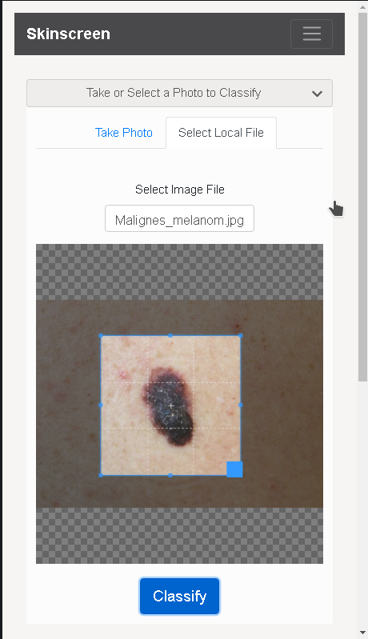
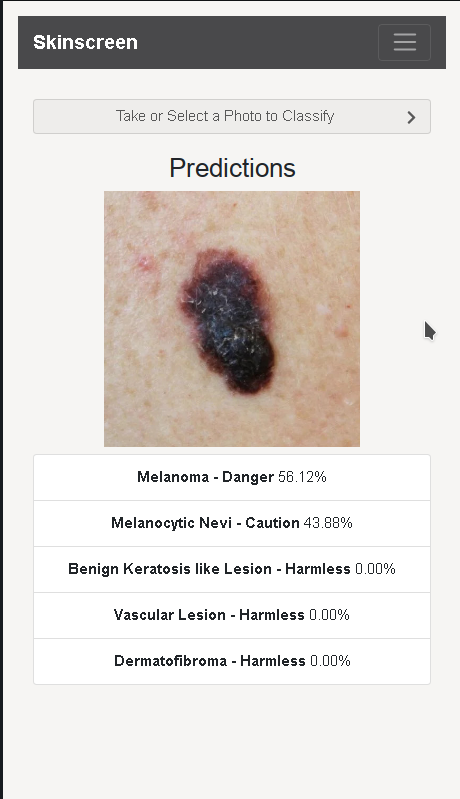

# Progressive web application for offline skin cancer image classification

Offline Skin Lesions Classification with Deep Convolutional Neural Network, that runs on your device. No image or data is uploaded in order to preserve privacy.

The app comes with a neural network that I trained using HAM10000 dataset. 
https://dataverse.harvard.edu/dataset.xhtml?persistentId=doi:10.7910/DVN/DBW86T

 

## Using the App

 
Open https://ricsc.github.io/skinscreen/ in your clients browser.

The app allows you to either use your device's camera to snap an image or select a local image from
the device's filesystem. Select an image of an object or put the object in frame using your camera,
then click classify. Local inference will then be performed, and the top five results will be given.
 

 

## Notes

<b>Warning:</b> Do not rely on the app predictions. Use it with a grain of salt. Anyways, if predictions give you a high score for classes that are labeled with Danger or Caution, then I urge you to get seek the help of a professionaly dermatologist.

 

## Links

* [TensorFlow.js](https://www.tensorflow.org/js)
* [React](https://reactjs.org/)
* [Progressive Web Apps](https://developers.google.com/web/progressive-web-apps/)
* [Service Workers](https://developer.mozilla.org/en-US/docs/Web/API/Service_Worker_API)
* [Web App Manifest](https://developers.google.com/web/fundamentals/web-app-manifest/)
* [IndexedDB](https://developer.mozilla.org/en-US/docs/Web/API/IndexedDB_API)
* [React Bootstrap](https://react-bootstrap.github.io/)

## License

This code pattern is licensed under the Apache Software License, Version 2.  Separate third party code objects invoked within this code pattern are licensed by their respective providers pursuant to their own separate licenses. Contributions are subject to the [Developer Certificate of Origin, Version 1.1 (DCO)](https://developercertificate.org/) and the [Apache Software License, Version 2](https://www.apache.org/licenses/LICENSE-2.0.txt).

[Apache Software License (ASL) FAQ](https://www.apache.org/foundation/license-faq.html#WhatDoesItMEAN)
